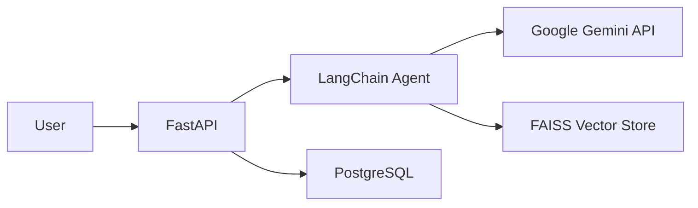

# Docker Memory Configuration Guide

This document explains the Docker resource allocation for the PaintMatch-AI application.

---

## Architecture Overview

PaintMatch-AI is an AI-powered chatbot that:
- Recommends Suvinil paints based on user queries
- Generates visualization images of painted environments
- Uses **Google Gemini API** for all AI processing (no local models)



---

## Memory Consumption Breakdown

### API Container

| Component | Memory Usage | Notes |
|-----------|--------------|-------|
| Python 3.13 Runtime | ~50-80 MB | Base interpreter |
| FastAPI + Uvicorn | ~30-50 MB | Web framework overhead |
| LangChain Framework | ~100-150 MB | Agent and RAG imports |
| FAISS Vector Store | ~50-100 MB | 26 paint embeddings |
| Google AI SDK | ~20-30 MB | HTTP client only |
| SQLAlchemy | ~30-40 MB | ORM + connection pool |
| **Total (idle)** | **~280-350 MB** | |
| **Peak (request)** | **~450-500 MB** | During chat + image generation |

### PostgreSQL Container

| Component | Memory Usage | Notes |
|-----------|--------------|-------|
| PostgreSQL Server | ~100-150 MB | Default configuration |
| Shared Buffers | 128 MB | PostgreSQL default |
| Data Size | < 1 MB | Only 26 paint records |
| **Total** | **~200-250 MB** | |

---

## Why These Limits?

### API: 768 MB Limit

```
Base memory:     ~300 MB
Peak overhead:   +200 MB (during AI requests)
Safety margin:   +268 MB (35% buffer)
─────────────────────────
Total:            768 MB
```

### PostgreSQL: 256 MB Limit

```
Server overhead: ~150 MB
Shared buffers:  +100 MB
Safety margin:   +6 MB
─────────────────────────
Total:            256 MB
```

---

## Resource Configuration

```yaml
# docker-compose.yml
services:
  postgres:
    deploy:
      resources:
        limits:
          memory: 256M
          cpus: '0.25'
        reservations:
          memory: 128M

  api:
    deploy:
      resources:
        limits:
          memory: 768M
          cpus: '0.75'
        reservations:
          memory: 384M
```

---

## Key Insight: API-Based AI

> **All AI inference happens remotely via Google's servers.**

This means:
- ✅ No GPU required locally
- ✅ No large model weights in memory
- ✅ Memory usage stays low and predictable
- ✅ Cost is per-API-call, not infrastructure

The application is primarily **I/O bound** (waiting for API responses), not compute bound.

---

## Monitoring Commands

```bash
# Real-time container stats
docker stats

# Check for OOM kills
docker inspect <container> | grep -i oom

# View memory limits
docker compose config | grep -A5 resources
```

---

## Scaling Considerations

If you need to handle more concurrent users:

| Users | API Memory | API CPU |
|-------|------------|---------|
| 1-5 | 768M | 0.75 |
| 5-10 | 1G | 1.0 |
| 10+ | Consider horizontal scaling |

---
